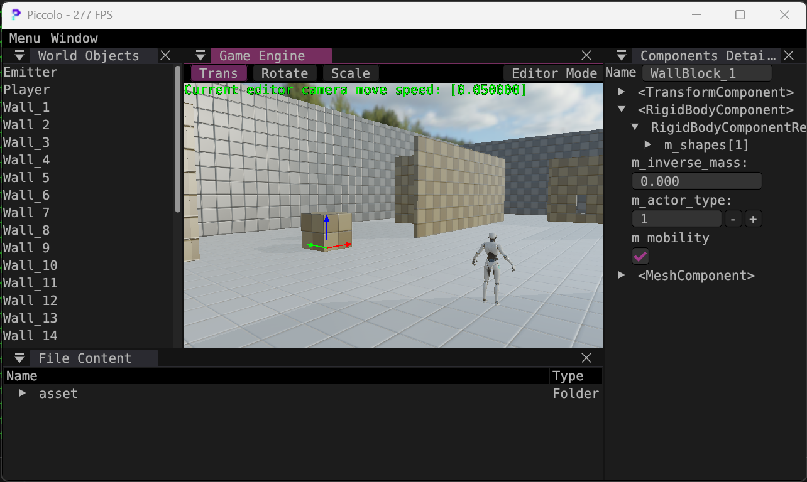

# 作业 4

作业4的代码基于main分支而非`games104/homework04-tool-chains`分支，因为作业分支的物理有bug。此外main分支的component逻辑也更清晰，便于修改。

------
## 1 - 新增或修改属性的定义及意义说明

在`RigidBodyComponentRes`中新增了公有属性`bool m_mobility`。

- 该属性为`true`时，物体在游戏中可以被角色移动。

- 属性为`false`时，物体在游戏中保持静止，并且在游戏中不可被新增/消除。

------

## 2 - 新增或修改属性在 Components Details 面板上显示的截图



------

## 3 - 使该属性在其系统内生效的代码说明，包括代码解释及实现思路说明

#### **思路**

当角色推动物体时，物体应沿着碰撞法线方向向前移动。因此实现时应在`CharacterController::move(...)`中与角色的物理一起实现。

首先做碰撞检测，根据检测结果找到发生碰撞的物体。如果该物体的`m_mobility`为`true`，则先根据角色的位移算出位移在碰撞法线上的投影，然后将物体根据投影前移。

这里应该通过给物体施加力来实现，但考虑到游戏体验（以及很多物体都没有具体定义质量），直接用了让物体跟着角色一起移动的方式。

#### **代码解释**

**_实现反射_**

在`runtime\resource\res_type\components\rigid_body.h`中，因为`RigidBodyComponentRes`本身已有反射标签（所有属性都可以反射），我直接添加了公有属性：`bool m_mobility;`。在main分支代码的基础上，bool类型的UI已经写好，因此该新增属性会直接显示在面板上。

新属性的值在各种json里可以设定。

**_实现效果_**

在homework03的基础上添加代码，在`CharacterController::move(...)`中，先通过`getAllGObjects()`获得当前场景中的所有物体：

```Cpp
std::shared_ptr<Level> level = g_runtime_global_context.m_world_manager->getCurrentActiveLevel().lock();
if (level == nullptr)
    return final_position;
auto& gomap = level->getAllGObjects();
```

如果发生碰撞，碰撞时会获得一个碰撞物体的`body_id`。遍历当前场景中的所有物体，可以找到该`body_id`对应的component wrapper：

```
for (auto & hit : hits)
{
    for (auto & go : gomap)
    {
        RigidBodyComponent* rbc = go.second->tryGetComponent<RigidBodyComponent>("RigidBodyComponent");
        if (rbc != nullptr && rbc->getRigidBodyID() == hit.body_id)
        {
            ...
        }
    }
}
```

找到component之后，用component中反射的数据来判断该物体是否可以移动。如果可以移动，算出物体所需的位移并移动该物体：

```
Vector3 object_horizontal_displacement = (horizontal_displacement.dotProduct(hit.hit_normal) * hit.hit_normal);
if (rbc->getMobility() == true)
    tfc->setPosition(tfc->getPosition() + object_horizontal_displacement);
```

实现过程中，我给`RigidBodyComponent`类添加了两个getter方法用来更便捷地获取`body_id`和`m_mobility`：

```
uint32_t getRigidBodyID() const { return m_rigidbody_id; }
bool getMobility() const { return m_rigidbody_res.m_mobility; }
```


**_一些思考_**

从`games104/homework04-tool-chains`切到`main`分支，虽然框架的逻辑变得更清晰了，但感觉还是有一些地方没能处理好。

比如根据body_id获取component，需要遍历所有component才能找到。RigidBodyComponent和RigidBodyShape之间没有parent-child的关系，从scene或者level里面也无法轻易地获取到component，这是两处我认为可以改进的地方，也会让之后增加物理效果变得更方便。但因为时间关系（以及如果要改这些结构，最好不是在作业中完成而是直接提PR），本次作业中我没有对此进行改动。