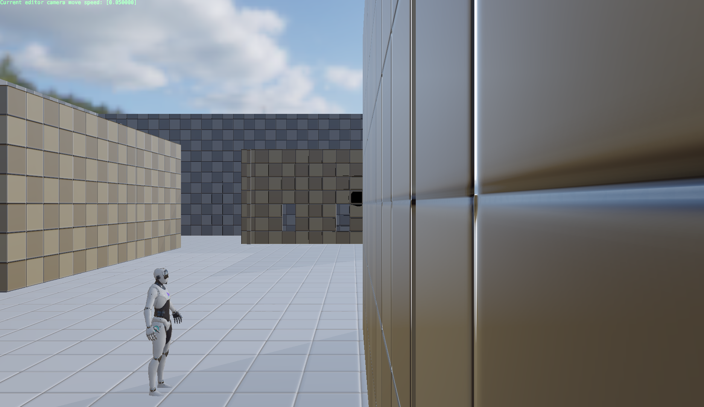
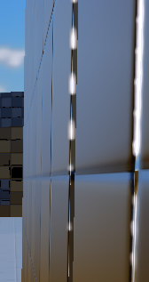
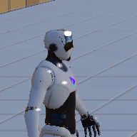

# Homework 2

For full code, see the end of each task section.

## Task 1

### Implementation

Given the task description and hints in lecture ("using linear interpolation"), the general idea of my implementation is to,

1. Get 2 color samples neighboring each other
2. Interpolate between them and get output

When sampling 2 color samples, note that there needs to be a 0.5 offset for properly sampling between 2 pixels.


### Task 1 - Result

Without color-grading:



With color-grading (color_grading_lut_05.png):

")


### Task 1 - Code

**Full Code of color_grading.frag**

```Cpp
#version 310 es

#extension GL_GOOGLE_include_directive : enable

#include "constants.h"

layout(input_attachment_index = 0, set = 0, binding = 0) uniform highp subpassInput in_color;

layout(set = 0, binding = 1) uniform sampler2D color_grading_lut_texture_sampler;

layout(location = 0) out highp vec4 out_color;

void main()
{
    highp ivec2 lut_tex_size = textureSize(color_grading_lut_texture_sampler, 0);
    highp float _COLORS      = float(lut_tex_size.y);
    highp vec4 color       = subpassLoad(in_color).rgba;
    
    highp float size = 16.0;

    // Base unit to move colors
    highp vec3 pos_base = vec3(1.0/float(lut_tex_size.x),  1.0/float(lut_tex_size.y), size - 1.0f);

    // Get the position of 2 colors
    highp float currpos = floor(color.b * pos_base.z);
    highp float currpos_distance = (color.b * pos_base.z) - currpos;
    highp float x = color.r * pos_base.x * pos_base.z + pos_base.y * currpos;
    highp float y = color.g * pos_base.y * pos_base.z;

    // Sample 2 colors to interpolate
    highp vec2 uv1 = vec2(x + pos_base.x * 0.5, y + pos_base.y * 0.5);
    highp vec2 uv2 = vec2(x + pos_base.x * 0.5 + pos_base.y, y + pos_base.y * 0.5);
    highp vec3 color1 = texture(color_grading_lut_texture_sampler, uv1).rgb;
    highp vec3 color2 = texture(color_grading_lut_texture_sampler, uv2).rgb;

    // Interpolation, note that mix in OpenGL: mix(x, y, a): x * (1 - a) + y * a
    highp vec3 color_res = mix(color1, color2, currpos_distance);

    out_color.rgb = color_res;
}
```


## Task 2

### Implementation

I found a free LUT (in .cube) online and adjusted it a bit to make the coloring stronger. It gives strong saturation in blue and orange, producing an "early-morning" vibe. Then I exported a 256x16 png with it.

### Task 2 - Result

With customized color-grading (color_grading_lut_05.png):

")


## Task 3

### Implementation

I chose to implement Blooming effect based on [Bloom - LearnOpenGL](https://learnopengl.com/Advanced-Lighting/Bloom). The general process is listed below:

1. Get pixels with high brightness
2. Use a 1D Gaussian kernel to blur the highlighted pixels in x-direction
3. Use a 1D Gaussian kernel to blur the highlighted pixels in y-direction, then output to the next subpass

For the 3 steps I divided them into 3 subpasses. Usually the 2nd and 3rd subpasses could have been merged into one, but since I'm still new to Vulkan, I separated them.

**Step 1**

Corresponding code: `engine/source/runtime/function/render/source/vulkan_manager/passes/brightness_filter.cpp`

Fragment shader: `engine/shader/glsl/brightness_filter.frag`

Following `color_grading.cpp`, I created a new subpass in `brightness_filter.cpp`. This new subpass takes `attachments[_main_camera_pass_backup_buffer_odd]` as input, and outputs to another buffer, `_main_camera_pass_brightness_buffer`, that I created in advance. 

Since tone mapping should take place after bloom effect, I put this subpass before tone mapping, and added dependencies in `main_camera.cpp`. Afterwards, I added this subpass into `PMainCameraPass::draw(...)` and `PVulkanManager::recreateSwapChain(...)` etc.

The fragment shader is only filtering the bright pixels with a high-pass filter. I also tried to "soften" the edge pf glowing parts a bit by linearly interpolating around the threshold.


**Step 2**

Correponding code: `engine/source/runtime/function/render/source/vulkan_manager/passes/gaussian_blur_x.cpp`

Vertex shader: `engine/shader/glsl/gaussian_blur_x.vert`

Fragment shader: `engine/shader/glsl/gaussian_blur_x.frag`

This subpass samples from the output of brightness_filter, `f`, and filters the sample with a 1D Gaussian kernel. For correct sampling, this subpass needs UV of each pixel in the scene.

The vertex shader generates UV of each pixel in full-screen coordinates, then the fragment shader translates the UV into viewport coordinates (without editor UI). This translation happens within the fragment shader. To pass the transformation into shader, a storage buffer is needed. Here I used the built-in `m_p_global_render_resource->_storage_buffer._global_upload_ringbuffer` so that it doesn't need to be initialized again.

The buffer is supposed to be updated when viewport dimensions change. Typically it happens during `updateAfterFramebufferRecreate(...)` of each render pass. During experiments, I found that the editor UI dimensions are not updated before UIPass draws, i.e. viewport coordinates cannot be caught in the very first rendering process. Also, the engine has a bug of not updating editor UI dimensions properly when maximizing/minimizing the UI window.

After trying to fix the forementioned bugs but failed (didn't want to change the pipeline too much), I decided to put the storage buffer updates in `PMainCameraPass::draw(...)`, i.e. updating the dimensions in every frame. This slows down the performance hugely and brings a lot of rendering artifacts (flickering due to I/O). Till now I haven't found a better and easier way to solve this issue.

After passing the storage buffer into fragment shader, I passed a sampler using the result of previous pass, `_main_camera_pass_brightness_buffer`, as the texture to be sampled. Then I implemented a 1D Gaussian kernel with the sampled RGB values, to blur the image on x-direction.


**Step 3**

Correponding code: `engine/source/runtime/function/render/source/vulkan_manager/passes/gaussian_blur_y.cpp`

Vertex shader: `engine/shader/glsl/gaussian_blur_x.vert` (yes, it's the same as previous)

Fragment shader: `engine/shader/glsl/gaussian_blur_y.frag`

This subpass samples from the output of `gaussian_blur_x`, blur it in y-direction, then blend it with original scene, then output to another buffer . Compared to `gaussian_blur_x`, the biggest is color blending. Here I write the result into `attachments[_main_camera_pass_backup_buffer_odd]` with `VK_BLEND_OP_ADD`.


### Task 3 - Result

The initial scene in the engine is outdoors with daylight, making it harder to observe the bloom effects. Still, it's obvious that the highlights (clouds, wall edges) in the scene are slightly glowing.

With blooming filter:

")

Without blooming filter:

")

### Task 3 - Discussion

The general concept of bloom filter is simple, but the implementation using Pilot has been challenging. Here are a few thoughts that might make the performance smoother & better:

- An anti-aliasing pass will make the glowing parts more continuous at edges, e.g.,
  
  

   since the local brightness will have a smoother distribution. This can prevent the current glows from being fragmented.

- There are some flickering artifacts, especially on the character's body, e.g. on the character's head:

  

  I tried to eliminate it but failed. I suspect this artifact comes from sampling, but not sure what's the exact cause.

- Initialization of engine can be optimized by adding an inital viewport width/height. Then all the render passes which needs this information during rendering won't have to update their UBO every frame.

### Task 3 - Some Code

**Code fragments of brightness_filter.frag**

```Cpp
...
...
void main()
{
    highp vec4 color       = subpassLoad(in_color).rgba;

    highp float brightness = dot(color.rgb, vec3(0.2126, 0.7152, 0.0722));
    if(brightness > 0.4) {  // here this limit should be smaller than `minVal` in soften(...)
        out_color = vec4(color.rgb * soften(brightness), 1.0);
    } else {
        out_color = vec4(0.0, 0.0, 0.0, 1.0);
    }
}

// A "softer" blending of glow & darkness but failed
highp float soften(highp float br) {
    highp float minVal = 0.8;
    highp float maxVal = 0.95;
    if (br >= maxVal)
        return br;
    if (br <= minVal)
        return 0.0;
    return (br-minVal)*(maxVal/(maxVal - minVal));
}
```


**Code fragments of gaussian_blur_x.frag**

```Cpp
...
...
highp vec2 get_viewport_uv(highp vec2 full_screen_uv);

void main()
{
    highp float weight[5];
	weight[0] = 0.227027;
	weight[1] = 0.1945946;
	weight[2] = 0.1216216;
	weight[3] = 0.054054;
	weight[4] = 0.016216;

    highp vec2 sample_uv = get_viewport_uv(in_texcoord.xy);

    highp float intensity = 0.5;
    highp float range = 1.0;

    highp float tox = 1.0 / float(textureSize(scene_sampler, 0).x) * range;
    highp float toy = 1.0 / float(textureSize(scene_sampler, 0).y) * range;

    highp vec2 tex_offset = vec2(tox, toy);
    highp vec4 sampled_color = texture(scene_sampler, sample_uv).rgba;

    highp vec3 result = texture(scene_sampler, sample_uv).rgb * weight[0];

    for(int i = 1; i < 5; ++i)
    {
        result += texture(scene_sampler, sample_uv + vec2(tex_offset.x * float(i), 0.0)).rgb * weight[i] * intensity;
        result += texture(scene_sampler, sample_uv - vec2(tex_offset.x * float(i), 0.0)).rgb * weight[i] * intensity;
    }

    out_color = vec4(result, 1.0);

}

highp vec2 get_viewport_uv(highp vec2 full_screen_uv)
{
    highp vec2 editor_ratio = editor_screen_resolution.zw / screen_resolution.xy;
    highp vec2 offset = editor_screen_resolution.xy / screen_resolution.xy;
    highp vec2 viewport_uv = full_screen_uv.xy * editor_ratio + offset;
    
    return viewport_uv;
}
```